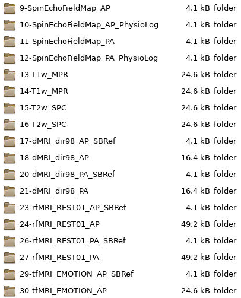
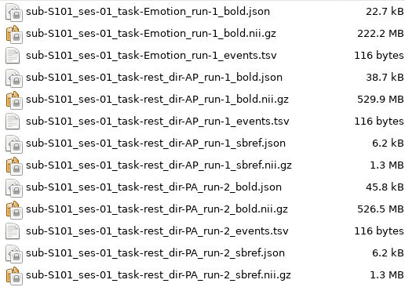
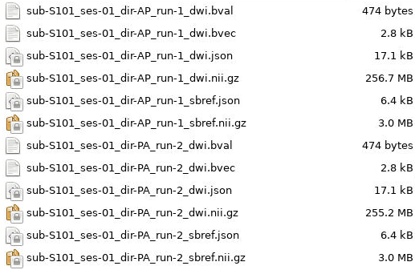

# Practical HeuDiConv Example

## HeuDiConv

The tool we use for automatic conversion is [HeuDiConv](https://github.com/nipy/heudiconv), a heuristic-based dicom converter. This tool is packaged as a Python library, and so in order to have access to it, you will need to create an Anaconda environment and install both HeuDiConv as well as dcm2niix, the actual dicom conversion engine.

You can do this process manually through the following commands

``` bash
module load Anaconda3/2020.11

conda create -n bids
conda activate bids

pip install heudiconv==0.9.0

conda install -c conda-forge dcm2niix
```

Or, you can go to [the example scripts page](heudiconv-scripts.md#create-conda-environment), copy the environment creation script there to a .sh file, and then submit it as a batch job.

## Initial Folder Structure

For this example, the dataset will be named `D01`, and its parent directory will be `/data/project/genlab/datasets` to mimic a generic project directory found on Cheaha. When running this tool, be sure to change any paths and folder or subject names to match your dataset.

For this walkthrough and in the example scripts, we assume an single session initial folder structure that looks like:

``` text
D01/
└── dicoms/
    ├── participant01/
    │   ├── scan-01/
    │   │   └── dicom files
    │   ├── scan-02/
    │   │   └── dicom files
    │   └── ...
    ├── participant02/
    │   ├── scan-01/
    │   │   └── dicom files
    │   └── ...
    └── ...
```

The raw dicoms are all stored in the `D01/dicoms` folder and are organized by participant and by scan. If multiple sessions were acquired for each participant, those sessions would be separated under the participant directory.

The example session has the following scan types:

- 1 T1w and 1 T2w
- 2 multiband resting state BOLDS
- 1 multiband emotion recognition BOLD named Emotion
- 2 two multiband diffusion scans
- A pair of spin-echo fieldmaps

A folder with those scans could look like the following:

<!-- markdownlint-disable MD033 -->
<figure markdown="1">

</figure>

Every multiband scan will have a corresponding SBRef scan that will also need to be accounted for in the key.

## Step 1: Generate Scan Info

<!-- markdownlint-disable MD046 -->
!!! note

    Remember, Step 1 only needs to be done once to generate the base heuristic and the scan parameters for key matching. The same heuristic can be used for every participant as long as the scan parameters are not changed.

The first step is to generate the scan info to match to. We can assign our dataset directory path to `BASE_DIR` for to make the command easier to type and more succinct.

<!-- markdownlint-disable MD046 -->
``` bash
# set the base dataset directory
BASE_DIR=/data/project/genlab/datasets/D01

heudiconv -s S101 -ss 01 -d $BASE_DIR/dicom/{subject}/ses-{session}/*/*.dcm
-o $BASE_DIR/nifti -f convertall -c none --overwrite
```

## Step 2: Example Heuristic

### Anatomicals

We have one T1w and one T2w scan, both of which have raw and normalized versions. In our case, we only want to convert the normalized versions. Our key for the anatomicals will be basic, only including the subject and session as variable. The keys will look like:

``` python
t1 = create_key('sub-{subject}/{session}/anat/sub-{subject}_{session}_T1w')
t2 = create_key('sub-{subject}/{session}/anat/sub-{subject}_{session}_T2w')
```

Next, we can determine the `if` statements for associating the keys with the `info` dictionary. Since we only want to use one T1w and one T2w, we can just assign the series ID directly to the `info` dictionary. We will match on the number of acquired slices, the `T?w` portion of the protocol name to differentiate between T1w and T2w, and 'NORM' in the image_type so that we choose the normalized scans. These `if` statements that go in the association loop will look like:

``` python
if (s.dim3 == 208) and ('T1w' in s.protocol_name) and ('NORM' in s.image_type):
    info[t1] = [s.series_id]
if (s.dim3 == 208) and ('T2w' in s.protocol_name) and ('NORM' in s.image_type):
    info[t2] = [s.series_id]
```

It is possible to use multiple T1w and T2w scans, although the keys and association statements would need to be amended to include run information. Examples of this can be seen in the `Functionals`, `Field Maps`, and `Diffusion` sections.

### Field Maps

We have two field maps taken in the AP and PA directions. In order to create a sufficient key, we will need to add the direction information to the key and association sections. Additionally, we can add run information in case some subjects have multiple fieldmaps. Our key for Spin Echo field maps will be:

``` python
fmap = create_key('sub-{subject}/{session}/fmap/sub-{subject}_{session}_dir-{dir}_run-{item:01d}_epi')
```

Since we are accounting for the possiblity of multiple field maps in the same direction, we will use the `append` method instead of direct assignment to the `info` dictionary. The field map association statement will look like:

``` python
if (s.dim4 == 3) and ('SpinEchoFieldMap_AP' in s.protocol_name):
    info[fmap].append({'item': s.series_id, 'dir':'AP'})
if (s.dim4 == 3) and ('SpinEchoFieldMap_PA' in s.protocol_name):
    info[fmap].append({'item': s.series_id, 'dir':'PA'})
```

We chose to match on the fact each field map has 3 volumes and contains SpinEchoFieldMap in the protocol_name. There is a split based on which direction the field map was acquired in which changes the `dir` field.

### Functionals

We have multiple resting state scans as well as an emotion recognition task scan. We will create separate keys and association statements for both of these types of scans. Because there are multiple resting state scans acquired in multiple directions, we will include direction and run information in the `rest` key.

Additionally, because these are multiband scans, there are SBRef volumes associated with both scan types. An SBRef key should be made alongside each BOLD scan type.

``` python
rest = create_key('sub-{subject}/{session}/func/sub-{subject}_{session}_task-rest_dir-{dir}_run-{item:01d}_bold')
rest_sbref = create_key('sub-{subject}/{session}/func/sub-{subject}_{session}_task-rest_dir-{dir}_run-{item:01d}_sbref')

emotion = create_key('sub-{subject}/{session}/func/sub-{subject}_{session}_task-Emotion_run-{item:01d}_bold')
emotion_sbref = create_key('sub-{subject}/{session}/func/sub-{subject}_{session}_task-Emotion_run-{item:01d}_sbref')
```

You can see that the only difference between the BOLD scans and their SBRef keys is that the `bold` tag at the end of the scan has been changed to `sbref`. The rest of the name should be exactly the same.

In the same way as the field maps, we will include run number for both rest and Emotion keys and direction information for the rest key and association statements.

``` python
# match REST scans and their SBRefs
if (s.dim4 == 420) and ('REST' in s.dcm_dir_name) and ('AP' in s.dcm_dir_name):
    info[rest].append({'item': s.series_id, 'dir': 'AP'})
if (s.dim4 == 420) and ('REST' in s.dcm_dir_name) and ('PA' in s.dcm_dir_name):
    info[rest].append({'item': s.series_id, 'dir': 'PA'})
if (s.dim4 == 1) and ('REST' in s.dcm_dir_name) and ('AP' in s.dcm_dir_name):
    info[rest_sbref].append({'item': s.series_id, 'dir':'AP'})
if (s.dim4 == 1) and ('REST' in s.dcm_dir_name) and ('PA' in s.dcm_dir_name):
    info[rest_sbref].append({'item': s.series_id, 'dir':'PA'})    


# match Emotion scans and their SBRefs
if (s.dim4 == 176) and ('EMOTION' in s.dcm_dir_name):
    info[emotion].append({'item': s.series_id})
if (s.dim4 == 1) and ('Emotion' in s.dcm_dir_name) and ('SBRef' in s.dcm_dir_name):
    info[emotion_sbref].append({'item': s.series_id})
```

For resting state scans, we matched on having 'REST' in the name and the direction the scan was acquired in. We also matched based on the number of volumes to differentiate between the BOLD scans and their SBRefs. The same thing was done for the Emotion scan and its SBRef minus the direction information.

### Diffusion

The diffusion block looks very similar to the functional block since we are adding both direction and run number to the key. Again, since the diffusion scans are also multiband, there will be SBRef volumes to convert as well. These SBrefs will have the same `sbref` tag at the end that the functional SBRefs had, but are differentiated by being stored in the `dwi` output directory with the diffusion scans.

``` python
dwi = create_key('sub-{subject}/{session}/dwi/sub-{subject}_{session}_dir-{dir}_run-{item:01d}_dwi')
dwi_sbref = create_key('sub-{subject}/{session}/dwi/sub-{subject}_{session}_dir-{dir}_run-{item:01d}_sbref')
```

The key association portion will also look similar to the functional section, substituting in diffusion scan information where necessary. Since we only have one overall type of diffusion scan (as opposed to task and rest being different for functionals), we will match on the 'dMRI' in the name as well as the direction.

``` python
# match full diffusion scans including direction
if (s.dim4 == 99) and ('dMRI' in s.dcm_dir_name) and ('AP' in s.dcm_dir_name):
    info[dwi].append({'item': s.series_id, 'dir':'AP'})
if (s.dim4 == 99) and ('dMRI' in s.dcm_dir_name) and ('PA' in s.dcm_dir_name):
    info[dwi].append({'item': s.series_id, 'dir':'PA'})

# match diffusion SBRef including direction to match the full dwi
# scan names
if (s.dim4 == 1) and ('dMRI' in s.dcm_dir_name) and ('AP' in s.dcm_dir_name):
    info[dwi_sbref].append({'item': s.series_id, 'dir':'AP'})
if (s.dim4 == 1) and ('dMRI' in s.dcm_dir_name) and ('PA' in s.dcm_dir_name):
    info[dwi_sbref].append({'item': s.series_id, 'dir':'PA'})
```

These block together form the full heuristic file we will use for sorting these data into BIDS format.The full heuristic file for this example, including the matching criteria, can be seen below:

``` python
import os

def create_key(template, outtype=('nii.gz',), annotation_classes=None):
    if template is None or not template:
        raise ValueError('Template must be a valid format string')
    return template, outtype, annotation_classes


def infotodict(seqinfo):
    """Heuristic evaluator for determining which runs belong where

    allowed template fields - follow python string module:

    item: index within category
    subject: participant id
    seqitem: run number during scanning
    subindex: sub index within group
    """

    ########################## Scan Keys ##############################
    t1 = create_key('sub-{subject}/{session}/anat/sub-{subject}_{session}_T1w')
    t2 = create_key('sub-{subject}/{session}/anat/sub-{subject}_{session}_T2w')

    fmap = create_key('sub-{subject}/{session}/fmap/sub-{subject}_{session}_dir-{dir}_run-{item:01d}_epi')

    rest = create_key('sub-{subject}/{session}/func/sub-{subject}_{session}_task-rest_dir-{dir}_run-{item:01d}_bold')
    rest_sbref = create_key('sub-{subject}/{session}/func/sub-{subject}_{session}_task-rest_dir-{dir}_run-{item:01d}_sbref')

    emotion = create_key('sub-{subject}/{session}/func/sub-{subject}_{session}_task-Emotion_run-{item:01d}_bold')
    emotion_sbref = create_key('sub-{subject}/{session}/func/sub-{subject}_{session}_task-Emotion_run-{item:01d}_sbref')

    dwi = create_key('sub-{subject}/{session}/dwi/sub-{subject}_{session}_dir-{dir}_run-{item:01d}_dwi')
    dwi_sbref = create_key('sub-{subject}/{session}/dwi/sub-{subject}_{session}_dir-{dir}_run-{item:01d}_sbref')

    info = {t1:[], t2:[], fmap:[], rest:[], emotion:[], rest_sbref:[], emotion_sbref:[], dwi:[], dwi_sbref:[]}

    ################# Associate Keys with Scans #######################
    for idx, s in enumerate(seqinfo):
        # match T1 and T2 scans. No appending due to only wanting a single
        # of each type
        if (s.dim3 == 208) and ('T1w' in s.protocol_name) and ('NORM' in s.image_type):
            info[t1] = [s.series_id]
        if (s.dim3 == 208) and ('T2w' in s.protocol_name) and ('NORM' in s.image_type):
            info[t2] = [s.series_id]

        # match phase-encoded fieldmaps including direction
        if (s.dim4 == 3) and ('SpinEchoFieldMap_AP' in s.protocol_name):
            info[fmap].append({'item': s.series_id, 'dir':'AP'})
        if (s.dim4 == 3) and ('SpinEchoFieldMap_PA' in s.protocol_name):
            info[fmap].append({'item': s.series_id, 'dir':'PA'})

        # match full functional scans including direction for the REST scans
        if (s.dim4 == 420) and ('REST' in s.dcm_dir_name) and ('AP' in s.dcm_dir_name):
            info[rest].append({'item': s.series_id, 'dir':'AP'})
        if (s.dim4 == 420) and ('REST' in s.dcm_dir_name) and ('PA' in s.dcm_dir_name):
            info[rest].append({'item': s.series_id, 'dir':'PA'})
        if (s.dim4 == 1) and ('REST' in s.dcm_dir_name) and ('AP' in s.dcm_dir_name):
            info[rest_sbref].append({'item': s.series_id, 'dir':'AP'})
        if (s.dim4 == 1) and ('REST' in s.dcm_dir_name) and ('PA' in s.dcm_dir_name):
            info[rest_sbref].append({'item': s.series_id, 'dir':'PA'})

        # match functional SBRef including direction to match the full functional scan names
        if (s.dim4 == 176) and ('EMOTION' in s.dcm_dir_name):
            info[emotion].append({'item': s.series_id})
        if (s.dim4 == 1) and ('EMOTION' in s.dcm_dir_name):
            info[emotion_sbref].append({'item': s.series_id})

        # match full diffusion scans including direction
        if (s.dim4 == 99) and ('dMRI' in s.dcm_dir_name) and ('AP' in s.dcm_dir_name):
            info[dwi].append({'item': s.series_id, 'dir':'AP'})
        if (s.dim4 == 99) and ('dMRI' in s.dcm_dir_name) and ('PA' in s.dcm_dir_name):
            info[dwi].append({'item': s.series_id, 'dir':'PA'})

        # match diffusion SBRef including direction to match the full dwi
        # scan names
        if (s.dim4 == 1) and ('dMRI' in s.dcm_dir_name) and ('AP' in s.dcm_dir_name):
            info[dwi_sbref].append({'item': s.series_id, 'dir':'AP'})
        if (s.dim4 == 1) and ('dMRI' in s.dcm_dir_name) and ('PA' in s.dcm_dir_name):
            info[dwi_sbref].append({'item': s.series_id, 'dir':'PA'})


    return info
```

## Step 3: BIDS Conversion

At this point, the heuristic is set up, and the last step is performing the sort. The command looks very similar to that in Step 1, with a couple of changes. The command we use here is:

``` bash
# Give a path to the dataset directory that we can use 
BASE_DIR=/data/project/genlab/datasets/D01

heudiconv -s S101 -ss 01 -d $BASE_DIR/dicom/{subject}/ses-{session}/*/*.dcm -o $BASE_DIR/nifti -f $BASE_DIR/heuristic.py -c dcm2niix -b --overwrite
```

The only options that have changed are:

- `-f`: changed from convertall to the path to the heuristic
- `-c`: changed from none to dcm2niix
- `-b`: added

## BIDS Outputs

Once the function finishes, there will a subject and session path in the `$BASE_DIR/nifti` directory that leads to the BIDS converted files. For this example, there will be `anat`, `fmap`, `func`, and `dwi` folders. The output file structure for these folders can be seen below.

**D01/nifti/sub-S101/ses-01/anat:**

<figure markdown="1">

</figure>

------------------------------------------------------------------------

**D01/nifti/sub-S101/ses-01/fmap:**

<figure markdown="1">

</figure>

------------------------------------------------------------------------

**D01/nifti/sub-S101/ses-01/func:**

<figure markdown="1">

</figure>
------------------------------------------------------------------------

**D01/nifti/sub-S101/ses-01/dwi:**

<figure markdown="1">

</figure>
