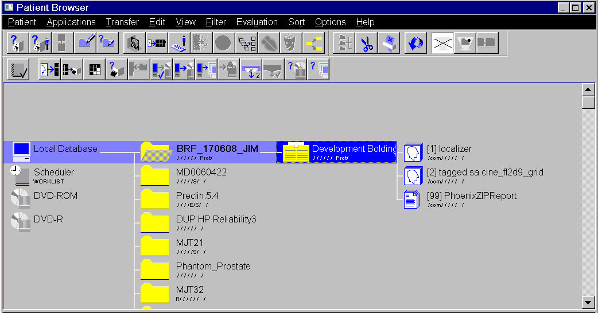

# Data Management

Scan data is stored on the scanner computer (host) immediately after acquisition. Reconstructed images are placed in an exam (patient) directory in the local database automatically. Exams are routinely deleted (usually 2-3 days after acquisition) from the local database due to storage constraints on the host.

!!! warning

    Investigators are encouraged to verify scan data is backed up in a secure location as soon as possible after acquisition. Failure to copy scan data immediately after an imaging exam may result in data loss.

Raw k-space data is temporarily stored on a RAID array. Data is deleted on a rolling basis (first in, first out). Depending on scanner utilization, raw data is maintained for 1-2 days.

## Transferring Scans to Remote DICOM Nodes

This is the most straightforward and recommended method of transferring data from the scanner. CINL has set up two remote DICOM nodes on the Prisma which are directly accessible from the Export menu: OSIRIX and XNAT. OSIRIX transfers data to an instance of OSIRIX running on a CINL Mac in the CINL Office/Equipment Room. Images may then be exported from the OSIRIX database to a USB drive or external disk.

!!! note
    It is the responsibility of Users to ensure that data is handled in accordance with their lab's protocols and all regulatory standards.

!!! warning
    
    Images in the OSIRIX database are automatically deleted three months (90 days) after the acquisition date.

To transfer scans to OSIRIX, perform the following steps:

1. Open the patient file browser

    

2. Select the participant you would like to transfer
3. Select Transfer >> Send To >> OSIRIX

Once this is selected, the transfer will begin.

### Non-DICOM Data

#### Scan Data

Non-dicom scan data must be transferred directly from the scanner computer to an external hard drive. These external hard drives must either come directly from CINL or be approved by CINL before use. **Do not use unapproved hard disks to retrieve data directly from the scanner computer**. This can cause issues with the scanner impacting future scans.

!!! important

    CINL drives may never leave Zone III of Highlands MRI or be used with any computers outside of the Osirix computer and the scanner computer. CINL approved drives are either those that CINL provides, or hardware encrypted (not software encrypted), or have a write protect switch. If you decide to purchase a drive that meets CINL’s qualifications, please let CINL staff know and we will label your drive accordingly. Note that CINL approved drives must only be used for transferring CINL data.

#### Physiological Data

Physiological data collected with the Prisma's Physiological Monitoring Unit (PMU) are not stored as DICOMs and must be retrieved from the scanner computer manually. If you need assistance with collecting physiological data, please contact us at [CINL@uab.edu](mailto:cinl@uab.edu).

BioPac sensors store data on the PC being used to run the BioPac data acquisition software.

#### Stimulus and Task Data

when presenting and recording data using the stimulus Mac or Windows machine, those can can be directly retrieved from those machines using an external disk or transferred to cloud storage when using the Mac. After transfer, please remove the created data files to prevent storage from becoming full.

## Transferring Scans to XNAT

XNAT is an online storage location for DICOM MRI data. You can transfer data directly to XNAT from the scanner computer and is freely available for anyone at UAB. Please read more about XNAT and how to use it in the [XNAT documentation](xnat/index.md).

## Scan Data Storage Protocol

Scan data is directly stored on the scanner computer after acquisition, but this computer is not meant for long-term data storage. Scans will be removed every week or when the local scanner drive is full. After being removed from this computer, if you did not transfer the data or the transfer was unsuccessful, the data is unrecoverable. It is good practice to transfer data to at least two of XNAT, OSIRIX, or a local drive. Do not leave data transfer up to chance!
